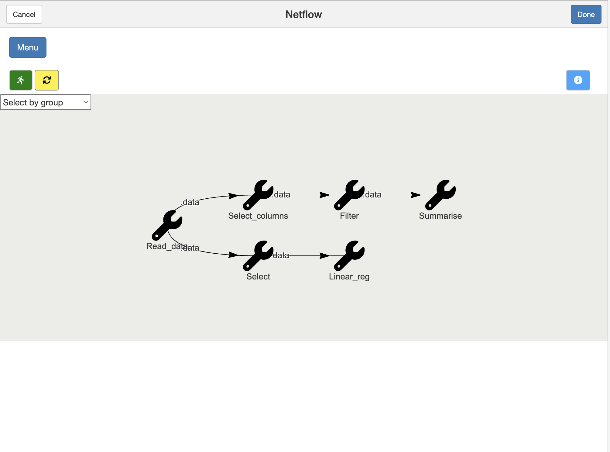

```{r setup, echo = FALSE, include=FALSE}
knitr::opts_chunk$set(collapse = TRUE,
                      comment = "#>",
                      eval = FALSE
)

library(ModelPath)

```

## Synapse/ModelPath: Visualize, Explore, and Model Your Data Processing Pipeline Interactively

Synapse/ModelPath is a R package that allows you to create a user interface of the data analytic pipeline. Your data analytic pipeline becomes transparent and interpretable to other users especially those who have no or little knowledge in R programming. It is currently under development.

To illustrate the utility of this package, we start with a simple toy problem. Suppose we want to build a pipeline that reads in the Iris data, removes the Species column, keeps all data with Petal.Length > 5, and finally takes the mean and standard deviation of the Petal.Length column. We first write this series of operations using the functions from the dplyr package and link them with the pipe (%>%).

```{r iris_branch_summary}
getIris <- function(){
  return (iris)
}

branch_summary <- parse_expr(quote(  
  getIris() %>%
    dplyr::select(-Petal.Width) %>%
    dplyr::filter(Petal.Length > 5) %>%
    dplyr::summarise(Mean = mean(Petal.Length, na.rm = T),
                     Std = sd(Petal.Length, na.rm = T))
), step_ids = c("Read_data", "Select_columns", "Filter", "Summarise"))
```

In this example, we first create a function that returns the Iris dataset. The series of operations can be found in the branch_summary. The function parse_expr takes a quoted expression, parse it into separate functional units according to the pipe, and assign them their own ids. The ids are provided in step_ids argument. In this case, the name "Read_data" is assigned to getIris; "Select_columns" is assigned to dplyr::select(-Petal.Width), etc.

We now build a network and renders the branch_summary.

```{r render_iris}
net <- Network$new("summary")$
        build_branch(branch_summary)

flow <- Netflow$new(id = "Iris")$
  add_network(net)

flow$net_flow()
```

A pop up window is opened which shows the branch_summary visually, with the nodes representing each operation in the branch. The node labels are the step ids previously assigned to the operations. 


Double click a node and another window is popped up. 


There are five tabs in this window: status, function, output table, output visualization, and description. In the figure above, it shows the status tab which provides the information on the operation status of the node. The function tab shows the argument that is receiving the output data from another node and the options that are available. The option parameters can be modified. The output table tab shows the output table after the function is applied. The output can be a data frame, a matrix, an array, or a summary description. The output visualization plots the output data. The description tab explains the usage of this node.

To run this network, click the Run button. If a node is successfully executed, it will turn green. A red colour indicates an error during the execution, while a yellow colour indicates the operation is being run.


Additional branches can be added to the network. For example, let's add a second branch:
```{r iris_branch_linreg}
branch_linreg <- parse_expr(quote(
  getIris() %>%
    dplyr::select(Sepal.Length, Petal.Length) %>%
    stats::lm(formula = Sepal.Length ~ Petal.Length, data = .)
), step_ids = c("Read_data", "Select", "Linear_reg"))

net$build_branch(branch_linreg)

flow <- Netflow$new(id = "Iris")$
  add_network(net)

flow$net_flow()
```

This branch takes the same iris data, selects the two columns Sepal.Length and Petal.Length, and runs the linear regression. Notice that the id node for the getIris is the same as the one in branch_summary because this branch will be built from the same node. Below shows the network with this new branch added to the network.



More complex pipelines can be created. Furthermore, separate networks can be built and combined and reused in different ways.

This package is still under development. A number of functionalities are being planned or or being implemented, including saving and loading networks, parallel processing, and better user interface just to name a few. 


