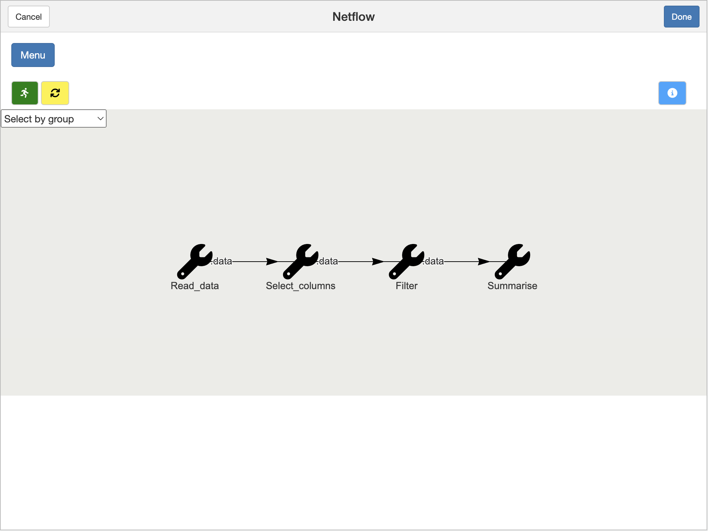
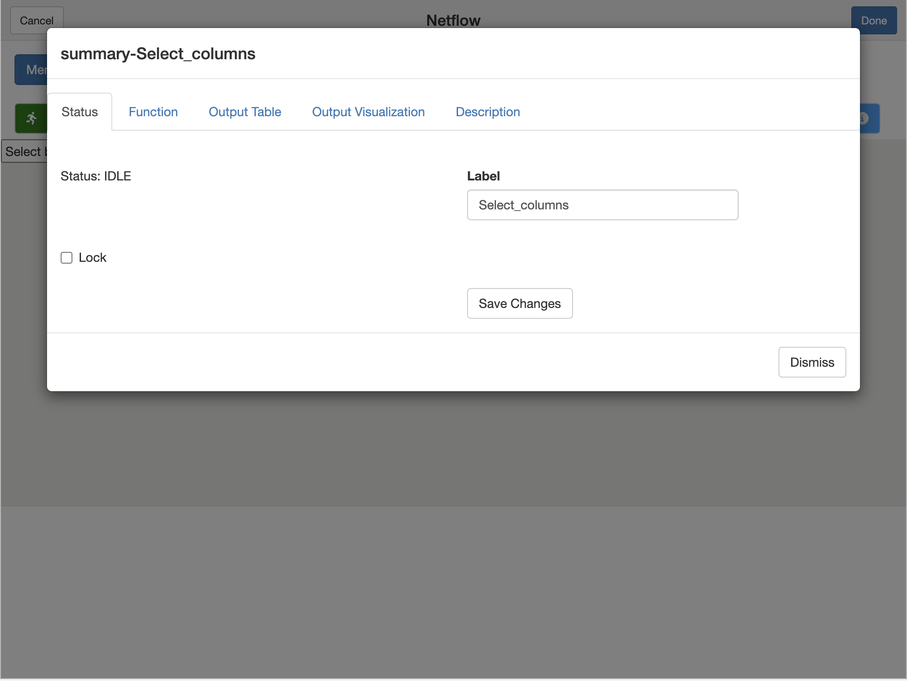
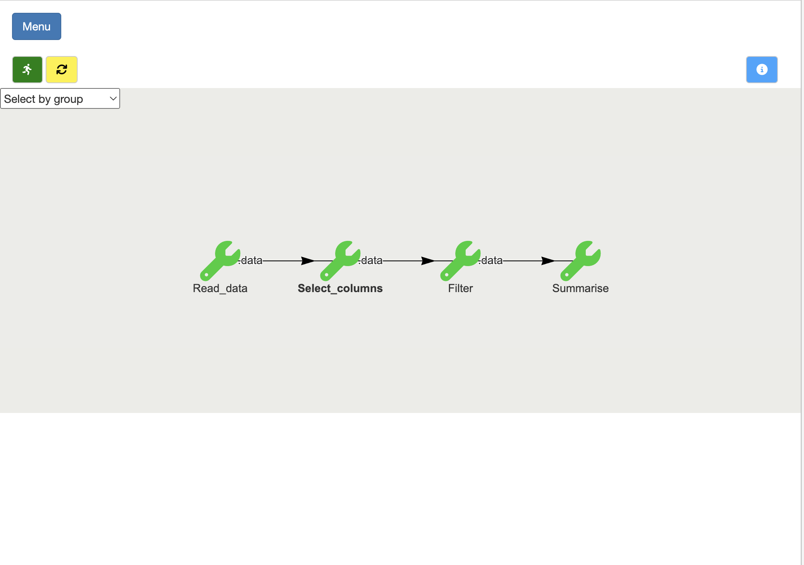
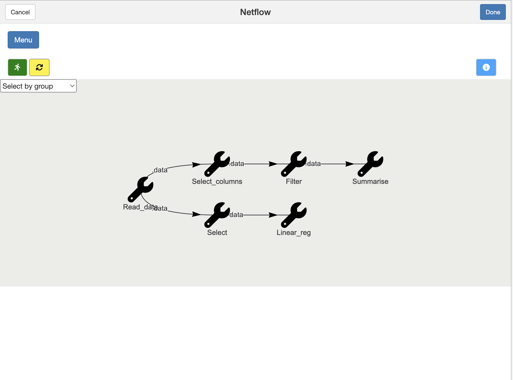
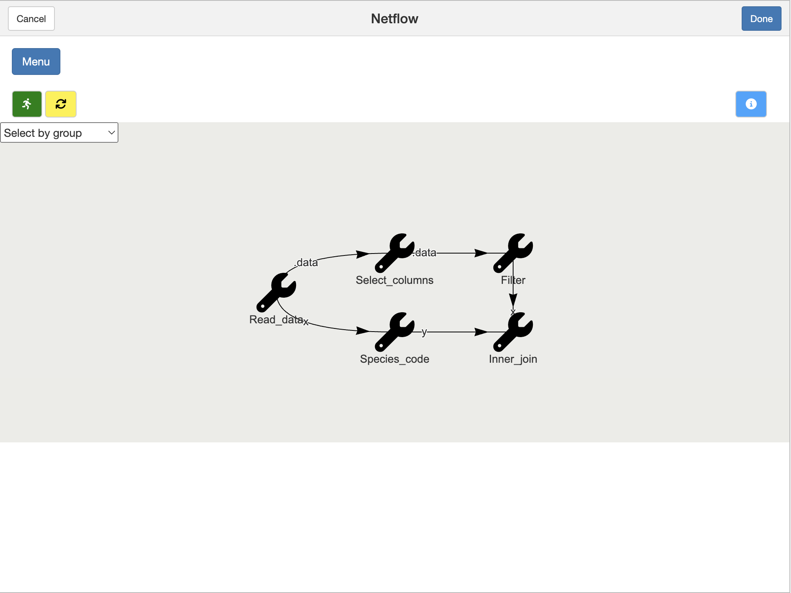

## Synapse/ModelPath: Visualize, Explore, and Model Your Data Processing Pipeline Interactively

Synapse/ModelPath is a R package that allows you to create a user
interface of the data analytic pipeline. Your data analytic pipeline
becomes transparent and interpretable to other users especially those
who have no or little knowledge in R programming. It is currently under
development.

To illustrate the utility of this package, we start with a simple toy
problem. Suppose we want to build a pipeline that reads in the Iris
data, removes the Species column, keeps all data with Petal.Length \> 5,
and finally takes the mean and standard deviation of the Petal.Length
column. We first write this series of operations using the functions
from the dplyr package and link them with the pipe (%\>%).

``` r
getIris <- function(){
  return (iris)
}

branch_summary <- parse_expr(quote(  
  getIris() %>%
    dplyr::select(-Petal.Width) %>%
    dplyr::filter(Petal.Length > 5) %>%
    dplyr::summarise(Mean = mean(Petal.Length, na.rm = T),
                     Std = sd(Petal.Length, na.rm = T))
), step_ids = c("Read_data", "Select_columns", "Filter", "Summarise"))
```

In this example, we first create a function that returns the Iris
dataset. The series of operations can be found in the branch_summary.
The function parse_expr takes a quoted expression, parse it into
separate functional units according to the pipe, and assign them their
own ids. The ids are provided in step_ids argument. In this case, the
name “Read_data” is assigned to getIris; “Select_columns” is assigned to
dplyr::select(-Petal.Width), etc.

We now build a network and renders the branch_summary.

``` r
net <- Network$new("summary")$
        build_branch(branch_summary)

flow <- Netflow$new(id = "Iris")$
  add_network(net)

flow$net_flow()
```

A pop up window is opened which shows the branch_summary visually, with
the nodes representing each operation in the branch. The node labels are
the step ids previously assigned to the operations.



Double click a node and another window is popped up.



There are five tabs in this window: status, function, output table,
output visualization, and description. In the figure above, it shows the
status tab which provides the information on the operation status of the
node. The function tab shows the argument that is receiving the output
data from another node and the options that are available. The option
parameters can be modified. The output table tab shows the output table
after the function is applied. The output can be a data frame, a matrix,
an array, or a summary description. The output visualization plots the
output data. The description tab explains the usage of this node.

To run this network, click the Run button. If a node is successfully
executed, it will turn green. A red colour indicates an error during the
execution, while a yellow colour indicates the operation is being run.



Additional branches can be added to the network. For example, let’s add
a second branch:

``` r
branch_linreg <- parse_expr(quote(
  getIris() %>%
    dplyr::select(Sepal.Length, Petal.Length) %>%
    stats::lm(formula = Sepal.Length ~ Petal.Length, data = .)
), step_ids = c("Read_data", "Select", "Linear_reg"))

net$build_branch(branch_linreg)

flow <- Netflow$new(id = "Iris")$
  add_network(net)

flow$net_flow()
```

This branch takes the same iris data, selects the two columns
Sepal.Length and Petal.Length, and runs the linear regression. Notice
that the id node for the getIris is the same as the one in
branch_summary because this branch will be built from the same node.
Below shows the network with this new branch added to the network.



Branches can also be joined together. In this example, two branches are
created and then joined together by dplyr::inner_join. The branch
branch_filter takes the iris data, removes the column Petal.Width, and
retains all entries with Petal.Length \> 5. The branch
branch_Species_recoded takes the iris data and creates a new column with
the function getSpeciesCode. This new column contains the numeric codes
for the distinct species in the column Species. The resulting new table
is joined with the output table from branch_filter.

``` r
getSpeciesCode <- function(x){
  species <- unique(x$Species)
  return (as.data.frame(list(Species = species, Species_code = seq(species))))
}

branch_filter <- parse_expr(quote(  
  getIris() %>%
    dplyr::select(-Petal.Width) %>%
    dplyr::filter(Petal.Length > 5) %>%
    dplyr::inner_join(x = ., by = "Species")
), step_ids = c("Read_data", "Select_columns", "Filter", "Inner_join"))

branch_Species_recoded <- parse_expr(quote(
  getIris() %>%
    getSpeciesCode() %>%
    dplyr::inner_join(y = .)
), step_ids = c("Read_data", "Species_code", "Inner_join"))

net <- Network$new("Species")$
              build_branch(branch_filter)$
              build_branch(branch_Species_recoded)

flow <- Netflow$new(id = "Iris")$
  add_network(net)

flow$net_flow()
```

In branch_filter, the dplyr::inner_join function uses the first argument
x as the input argument for the filtered data, and specifies that the
column “Species” as the column to join by. In branch_Species_recoded, it
specifies y as the input argument. The step id “Inner_join” is used for
both inner_join statements in both branches. Below shows the rendering
of this network.



More complex pipelines can be created. Furthermore, separate networks
can be built and combined and reused in different ways.

This package is still under development. A number of functionalities are
being planned or being implemented, including saving and loading
networks, parallel processing, and better user interface just to name a
few.
